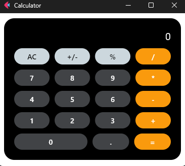

# CalculadoraIOS

## Descripción

## Funcionalidades Básicas
### Operaciones Aritméticas Básicas:
- [x] Suma, Resta, Multiplicación y División: 
La calculadora puede realizar estas cuatro operaciones fundamentales.
- [x] Porcentaje (%): 
Facilita el cálculo de porcentajes, útil en       contextos de finanzas o en el cálculo de descuentos y tasas de interés.
- [x] Inversión de Signo (+/-): 
Permite cambiar el signo de un número, una función esencial en cualquier calculadora.
- [x] Entrada Decimal:
Permite la entrada de números decimales para operaciones que requieren más precisión.
- [x] Operaciones Continuas:
La calculadora maneja operaciones en cadena, permitiendo que el usuario siga introduciendo operaciones sin tener que pulsar igual después de cada una. Por ejemplo, 5 + 5 - 3 * 2 se maneja sin problemas.
- [x] Borrado y Reinicio:
Con el botón "AC" (All Clear), los usuarios pueden borrar todo y empezar de nuevo, lo cual es fundamental para corregir errores o iniciar nuevos cálculos.
### Características de la Interfaz de Usuario
Estética Visual:
- [x] Colores y Diseño: Utiliza una combinación de colores (naranja, blanco y gris azulado) que son agradables y facilitan la distinción entre diferentes grupos de teclas (números, operadores, funciones especiales).
- [x] Diseño Responsive: Aunque simple, el diseño se adapta al tamaño del dispositivo, asegurando que los botones sean de fácil acceso en diferentes pantallas.
- [x] Feedback Visual:
Los resultados de las operaciones se actualizan inmediatamente en la pantalla, proporcionando un feedback instantáneo que es crucial para la usabilidad.

## Interfaz

